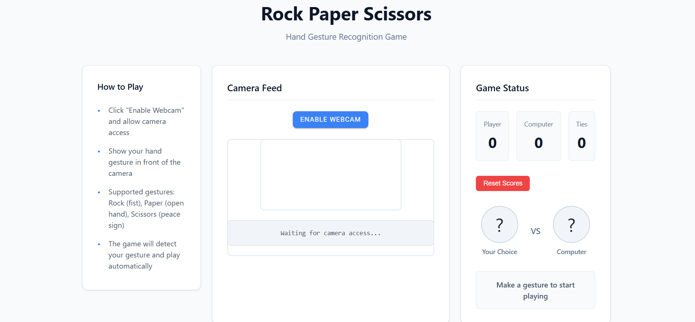
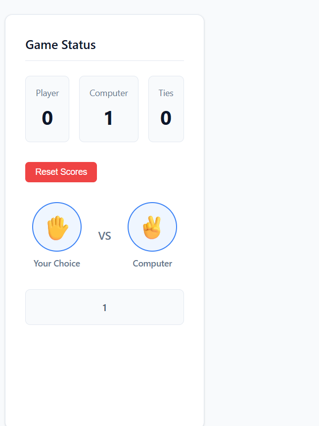

### Rock Paper Scissors — Hand Gesture Recognition

A polished browser-based Rock Paper Scissors game that uses MediaPipe gesture recognition to detect your hand gestures via webcam and play automatically.  
Replace the image placeholder below with your screenshot or demo GIF.



---

### Features
- Real-time hand gesture detection (rock, paper, scissors) using MediaPipe.  
- Automatic round play: reads your gesture, generates a computer choice, updates scores, and shows round result.  
- Clean emoji UI, responsive layout, and reset functionality.  
- Modular code: gesture mapping, evaluation logic, UI updates separated for clarity.

---

### Live Demo / Local URL
Open the demo at:
http://localhost:3000/

---

### Quick Start
1. Clone the repo.  
2. Open the project folder in a terminal.  
3. Start a static server:
   - npx http-server
   - or python -m http.server 3000
   - or run your Node/Express server if included.  
4. Open http://localhost:3000/ and click "Enable Webcam". Allow camera access.

---

### Usage
- Click "Enable Webcam" and allow camera access.  
- Show one of the supported gestures to the camera:
  - rock = closed fist
  - paper = open palm
  - scissors = victory/peace sign  
- The UI will display both choices, update the scores, and show the round status.

---

### Files (high level)
- index.html — main demo page and UI.  
- styles.css — styling for layout, scoreboard, and transitions.  
- app.js — gesture recognition loop, timer, game logic, and UI binding.  
- assets/ — images, icons, and screenshots.

---

### Key Implementation Notes
- Gesture mapping uses a lookup object to translate model labels into game labels.  
- Round resolution uses a win map that states what each gesture beats, avoiding nested ifs.  
- State flag prevents duplicate captures while the recognition loop runs.  
- Score UI updates are separated from game evaluation; evaluateRound updates state then calls updateScores.

---

### Example README-friendly Snippets
Start server (npm-free):
```
npx http-server
```

Image markdown placeholder:
```
